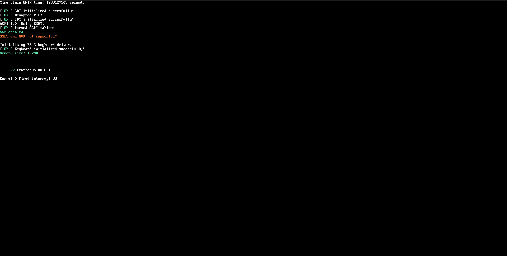
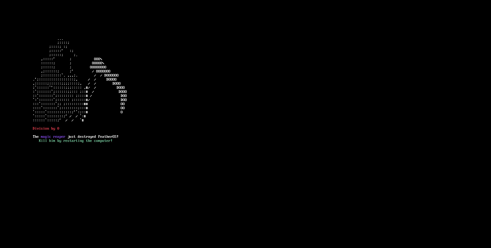

# FeatherOS
A simple x86 64-bit hobby operating system made in C and Assembly.




This project contains my shot at creating a functioning os and since I'm still learning a lot it may contain bad code, bad practices and bugs. I tried to run the os on my computer and a Thinkpad laptop and it worked without causing hassle.
For now the os does the following:
 - Sets up a GDT
 - Sets up IDT and handles exceptions and IRQs
 - Barebones ACPI driver.
 - SSE support.
 - Barebones PS/2 keyboard driver.
 - Simple terminal with colored strings output.
 - Framebuffer driver that can draw lines and rectangles.

## Why FeatherOS?
I like challenges so why not create an operating system? I want to have a deeper insight on how computers work and attempt to create difficult projects to sharpen my skills and abilities.

## Compiling
You need a cross compiler, the Makefile uses gcc and as a linker GNU ld.
To compile the os simply run:
```sh
sudo make
```

## Running the os
I use Qemu with the `qemu-system-x86_64` command, so install that and you're good to go.
To run it just type:
```sh
make run
```

Or alternatively if you want GDB to display information on your shell use:
```sh
make debug
```